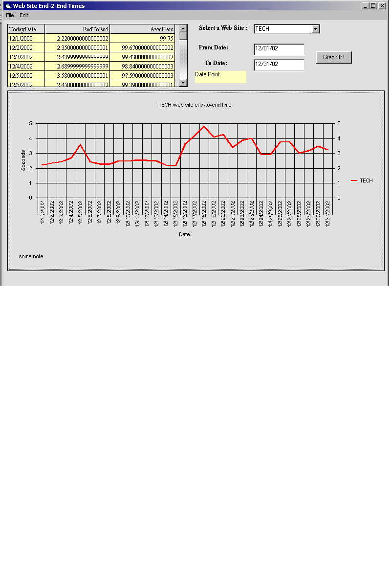



## MS\-Chart using ADO to get data

### Description

Exaple of using MS-Chart control and ADO database. Load data (by projet id, by dates) into 2 dim array and graph it. Ability to Save/Print/Copy graph .
 
### More Info
 

             |
---                |---
**Submitted On**   |2003-01-27 14:09:02
**By**             |[Abadani](https://github.com/Planet-Source-Code/PSCIndex/blob/master/ByAuthor/abadani.md)
**Level**          |Intermediate
**User Rating**    |4.5 (18 globes from 4 users)
**Compatibility**  |VB 6\.0
**Category**       |[Databases/ Data Access/ DAO/ ADO](https://github.com/Planet-Source-Code/PSCIndex/blob/master/ByCategory/databases-data-access-dao-ado__1-6.md)
**World**          |[Visual Basic](https://github.com/Planet-Source-Code/PSCIndex/blob/master/ByWorld/visual-basic.md)
**Archive File**   |[MS\-Chart\_u1535301272003\.zip](https://github.com/Planet-Source-Code/abadani-ms-chart-using-ado-to-get-data__1-42740/archive/master.zip)

